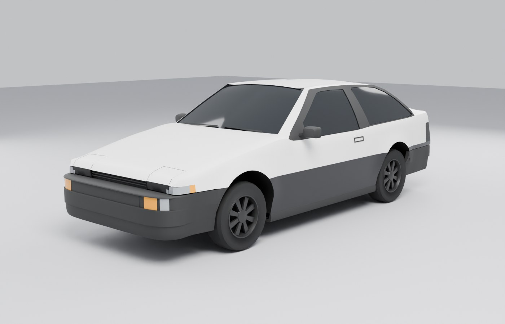
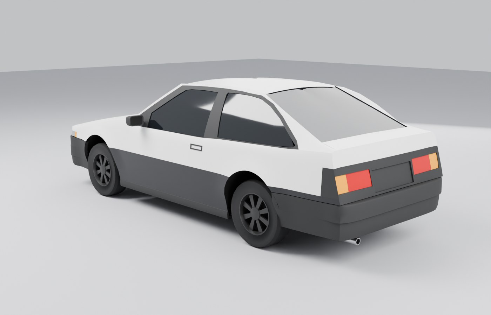

# Toyota AE86 Sprinter Trueno (3 portas, zenki): modelo game-ready para Roblox

Modelo exterior do AE86 Trueno, criado **do zero** no Blender 5.0 (módulo `bpy` 5.0.1).
Toda a geometria vem de código Python deste diretório, que monta superfícies a partir de curvas
medidas no blueprint e conferidas com fotos reais. Nenhuma malha externa foi baixada,
importada, copiada ou retopologizada.





Pranchas completas: [cor](renders/sheet_color.jpg) · [clay](renders/sheet_clay.jpg) · [wireframe](renders/sheet_wire.jpg)

## Entregáveis (`export/`)

| arquivo | conteúdo |
|---|---|
| `ae86_trueno.fbx` | modelo para o 3D Importer do Roblox (triangulado, normais divididas, UV provisório) |
| `ae86_trueno.blend` | cena do Blender 5.0 (quads, materiais provisórios, pivôs, UV) |
| `PopupHeadlights.server.lua` | script dos faróis escamoteáveis, com as medidas das dobradiças já preenchidas |
| `pivots.json` | tamanho, origem e contagem de triângulos de cada peça |

## Peças e orçamento

**Total: 14.110 triângulos** (limite: 15.000). Sem interior: os vidros são escuros e há apenas
caixas de roda, cavidades dos pop-ups e um assoalho plano para o carro não ficar "oco" visto de baixo.

| objeto | tris | observação |
|---|---:|---|
| `Body` | 7.114 | carroceria, caixas de roda, cavidades dos pop-ups, retrovisores, maçanetas, limpadores, abas de vedação |
| `Glass` | 740 | para-brisa, janelas laterais, vigia (recuados 6–7 mm, com moldura de borracha) |
| `Bumper_Front` | 1.390 | faixa da grade/lanternas rebaixada, prateleira sob o nariz, retorno no arco |
| `Bumper_Rear` | 986 | degrau inferior, prateleira sob o painel traseiro, ponteira do escapamento |
| `Skirt_L`, `Skirt_R` | 168 cada | saias laterais |
| `Popup_L`, `Popup_R` | 188 cada | faróis escamoteáveis funcionais (tampa, visor, lente com refletor redondo) |
| `Lights_Front` | 224 | lanternas de canto, piscas e luzes de posição do para-choque, grade |
| `Lights_Rear` | 208 | lanternas traseiras com moldura rebaixada |
| `Wheel_FL/FR/RL/RR` | 684 cada | pneu + roda de 8 raios, lado interno fechado |

Medidas usadas: comprimento 4.205 mm, largura 1.625 mm, altura 1.335 mm, entre-eixos 2.400 mm,
bitolas 1.355/1.345 mm.

## Pivôs

* **Rodas**: origem no centro do cubo; o eixo de rotação é o eixo lateral da peça.
* **Pop-ups**: origem na **linha da dobradiça**, na borda traseira da tampa. No estado padrão
  (fechado) a tampa fica rente ao capô, com folga de 3 mm. Para abrir, gire **52°** em torno do
  eixo lateral, levantando a frente: no Blender é `rotation_euler.x = -52°`. Aberta, a lente
  aponta para a frente; a validação foi feita sobrepondo a vista frontal do blueprint, que mostra
  os faróis abertos.
* As demais peças têm origem no chão, no centro do entre-eixos.

## Importando no Roblox

1. Studio → **Import 3D** → `export/ae86_trueno.fbx`. O arquivo está em metros (1 unidade = 1 m).
   O carro deve ter ~4,2 m de comprimento (cerca de 15 studs a 0,28 m/stud). Se vier com tamanho
   errado, ajuste a unidade/escala do arquivo no importador.
2. O FBX usa a convenção recomendada pelo Roblox para o Blender (Forward −Z, Up Y), e a frente do
   carro é a frente padrão do Blender (−Y). Se o carro chegar virado, corrija pela orientação do
   importador ou gire o modelo 180°. O script dos pop-ups não depende disso.
3. Cada objeto vira uma MeshPart com o mesmo nome. Os materiais são só referência (pintura,
   plástico, borracha, vidro, lentes, pneu, metal); a textura final será feita por UV.
4. Faróis escamoteáveis: coloque `export/PopupHeadlights.server.lua` como **Script** dentro do
   Model, ao lado de `Body`, `Popup_L` e `Popup_R`, e use:
   ```lua
   model:SetAttribute("Headlights", true)  -- abre
   model:SetAttribute("Headlights", false) -- fecha
   ```
   O script cria um `Motor6D` por farol sobre a linha da dobradiça. Ele deduz a frente do carro, a
   direção "para cima" e a escala a partir da própria geometria, então funciona com qualquer
   escala ou eixo de importação. Se o seu chassi soldar todas as peças (WeldConstraint), não solde
   os pop-ups: eles precisam ficar livres para o Motor6D.

## Como foi modelado

* `profiles.py`: perfis medidos (linha do capô, vinco da cintura, ombro do para-lama, linha
  da janela, tumble-home do vidro, coroamento do teto, arcos de roda com flare).
* `geom.py`: curvas Catmull-Rom, patches de Coons e um construtor de malha com solda e
  espelhamento.
* `body.py`: carroceria em patches. A lateral é desenhada na vista lateral e projetada na
  superfície lateral; capô e teto são campos de altura; molduras de janela e painel traseiro usam
  triangulação de Delaunay restrita. As feature lines (vinco da cintura, ombro, linha da janela,
  arcos, contornos das aberturas) são arestas marcadas como *sharp*. Superfícies planas continuam
  planas e só o que é curvo no carro real é suavizado.
* `parts.py`: para-choques por sweep de seções, saias, pop-ups, lanternas, vidros, rodas,
  retrovisores, caixas de roda e detalhes.
* A malha foi validada contra o blueprint (lateral, frente, traseira e topo, por sobreposição) e
  contra as fotos (câmeras nos mesmos ângulos). Também passou por um teste de faces invertidas
  (o Roblox não desenha a face de trás) e por verificação de arestas não-manifold e faces
  degeneradas.

## Reconstruir

```bash
python3.11 -m venv venv && venv/bin/pip install bpy==5.0.1 numpy pillow
BLENDER_PY=venv/bin/python ae86/make.sh          # build -> export -> renders
SKIP_RENDERS=1 BLENDER_PY=venv/bin/python ae86/make.sh   # só o modelo
```

## Limitações e próximos passos

* UVs geradas por Smart UV Project, como ponto de partida. Para texturizar com qualidade, vale
  refazer os seams.
* Faixas, emblemas ("TRUENO", "Fujiwara Tofu"), divisões de portas/capô e frisos ficam para a
  textura. A geometria só tem o que define volume e silhueta.
* A divisão branco/preto da pintura coincide com o vinco da cintura, para facilitar a textura.
